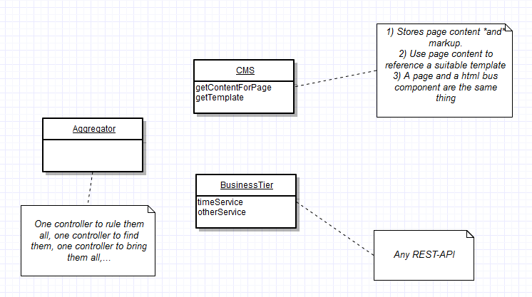
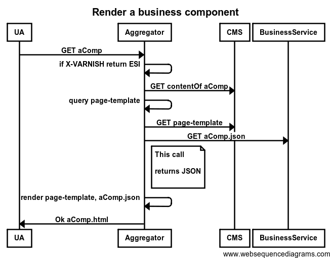

# Play Aggregator (of business and CMS data) 

## Some Rationale

The existing BMC journalsites pages exhibit quite a bit of code that looks like the following
 
    #if(site.isPortal)
       #some markup
    #else
       #some different markup
    #

Have you ever noticed that 90% of all controllers in 90% of all web applications in the world do pretty much the same thing?
They all duplicate the logic of loading business data and returning a page with a 200 response. For instance:

    someBeans = getSomeBusinessData()
    aTin = getPageView()
   
    return Ok(aTin, someBeans)
   

Why do people insist on writing a new controller for every new endpoint? Oh, Sun Microsystems J2EE tutorial and your spawn, 
you have so much to answer for!

In a website project, like Oscar, where we plan to define our site structures and their content in a CMS,
it would be unwise to then duplicate those structures (as hardcoded controllers/views for each endpoint). In doing
so, we require that changes to site structure be coordinated across application and CMS tiers. 
This is inflexible in practice and could lead us back to dark constructs like...

    #if(site.isPortal)
       #some markup
    #else
       #some different markup
    #
    
What can we do to solve this problem? Can we create a webapp that has just one controller for all
journal site endpoints and delegates all markup and structure to the CMS? 

## The Spike

This demo explores a potential solution that has three key features

- An abstract (business + cms) aggregator, with one controller for all endpoints (i.e., all endpoints that share the
_Ok(aTin, someBeans)_ implementation above).
- All site content and *markup* schemes defined in the CMS. This affords all the flexibility offered by the CMS (of sharing/forking markup 
between pages/sites). This avoids hardcoding a snapshot of this scheme in a webapp.
- REST-based business data coming, as *json*, from HTTP service components. The *HTML* rendering/markup for the business data is also defined in the CMS.
The business tier in this demo maintains the esi or html style shown in Chris James's play-esi. (As far as the aggregator is 
concerned, the business tier can be any REST API on the internet).

This diagram shows the basic organisation.

One thing to note is that the rendering of HTML business components and HTML pages happens in basically
the same way. The only difference is that components can additionally be rendered as an ESI:include whereas
pages cannot. The first sequence below shows the steps to render JSON business data as HTML

Markup for a page that uses a business component looks like

    <html>
        <head>
            <title>$pageContent.get('title')</title>  
        </head>
        <body>
            

            A business component with site/page specific rendering. Here it is:
            $requestTool.render('http://biomedcentral.com/components/time?businessUrl=<url of the json service>')
        </body>
    </html>

Line 3 of the snippet extracts some page content for the page title.

Line 8 makes a call to our old friend the time service. In this call, the `biomedcentral.com/components/time` identifies
 a *file in CMS*, which gives the content and template rendering options for the time service data. The `businessUrl` query parameter
 provides details of the backend service call.
 
The building up of components into pages is a recursive process. The template for the time HTML component could itself bring in other components. 

For me, the spike also served for learning more about Scala and Play. Apache velocity is used as the template language,
so it shows how to implement a template plugin for Play.  

## Technologies

- Play framework 2.2.1, with velocity as the templating language (using an [Furyu's Apache Velocity plugin](https://github.com/Furyu/play-velocity-plugin))
- Varnish for cacheing
- Apache Velocity
- Scala

## To run

- Install play and scala
- Fork or download this project
- Put the following entry in your hosts file
    127.0.0.1		biomedcentral.com
- Commands...
`$ cd play-aggregator`
`$ play run`
- Browse to
`http://biomedcentral.com:9000/index`
- Explore the code to see what's going on (see below)
- Hit the CMS 'simulator'. The simulated content for the page biomedcentral.com/index comes from `http://localhost:9000/cms/biomedcentral.com/index`
- Hit the JSON business objects. e.g. `http://localhost:9000/business-tier/json/time`
- Hit a rendered business component e.g. `http://biomedcentral.com:9000/components/time?businessUrl=http%3A%2F%2Flocalhost%3A9000%2Fbusiness-tier%2Fjson%2Ftime`
- Hit the same component, but with the X-VARNISH header.

## To play

- Modify the "page-template" value in resources/cms/biomedcentral.com/components/time to use global-time.vm. 
Hit `http://biomedcentral.com:9000/index` to see the difference.
- Copy the content under resources/cms/biomedcentral.com/index to another under resources/cms/biomedcentral.com/article.
Hit `http://biomedcentral.com:9000/article`. Create a new article.vm template and modify the article content to
point to this template. Hit `http://biomedcentral.com:9000/article` again.
- Create a genomebiology.com directory under resources/cms. Setup content files as for biomedcentral.com. Now you have
enabled a new site.
- Notice, *the steps above created new pages and sites, with no code changes. As long as the business services exist,
creating web pages is just that: creating web pages*.

## What's not covered

Caching of CMS content. CMS servers are known to be flaky (i.e. not designed with the same througput and uptime requirements as live webservers).
In this demo, though, there's a very chatty conversion with the CMS. In any real system, CMS content would have to be 
*persistently cached* in some kind of key-value store. Obviously, where the content happens to reside is secondary to 
where it is _defined_. 

Other controller behaviours. Stuff like login and form handling clearly does not fit into the standard (aTin + someBeans + 200) algorithm.

## Why do this?

- It's nice for UI developers if they can modify markup arbitrarily and not be tied into product release cycles.
- The aggregator is very simple so it can be developed and optimised early. This is good for a project where reliability
is important.

## Summary

This spike explores a simple, easily optimisable aggregation app, which keeps *all* page content in the CMS. There gives a
clean distinction between this CMS data and the business components and affords all the flexiblity of the CMS for setting up
websites. In particular, this is more flexible and involves less duplication than a proliferation of hardcoded controller 
endpoints thus making it less likely that hacks will creep in to work around this inflexibility.
